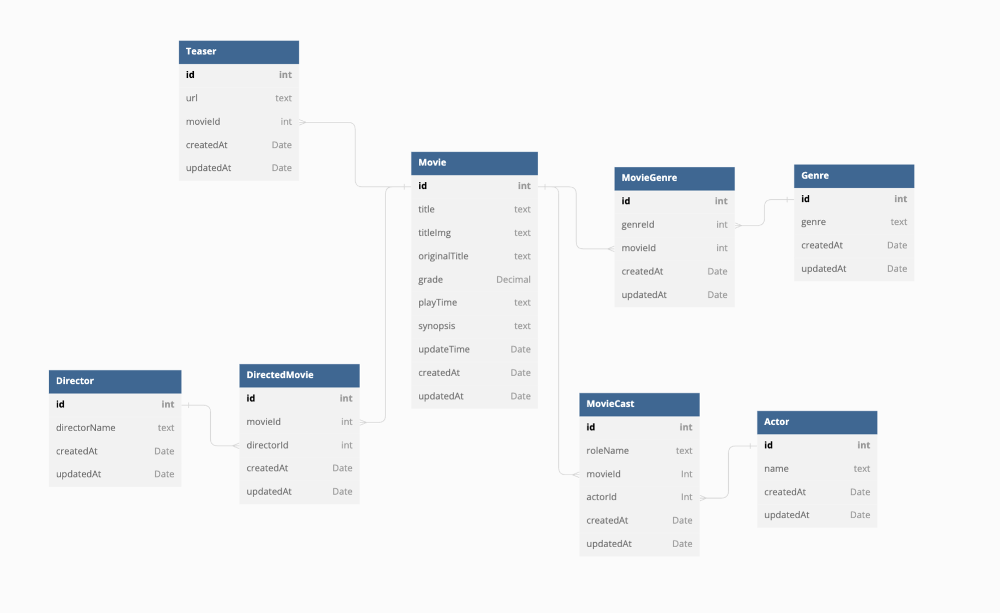

# 최제원 과제

### 안녕하세요, 지원자 최제원입니다 과제를 늦게 확인해서 조금 부족하지만 좋게 봐주시면 감사하겠습니다 <br>

# How to run

> 💡 Swagger URL <br>
> !! Make sure to start the server first and connect<br>
> http://localhost:8080/swagger <br>

## 1. create .env

```
// .movies/movies_backend/.development.env

NODE_ENV = development
SERVER_PORT = 8080
```

## 2. library install & prisma set up

```
// ./movies/movies_backend

yarn install
yarn prisma generate
yarn prisma db push
```

## 3. start project

```
// ./movies/movies_backend

yarn start:dev
```

## 4. start prisma studio

```
// * anotehr console
// ./movies/movies_backend

yarn prisma studio
```

# Database structure


